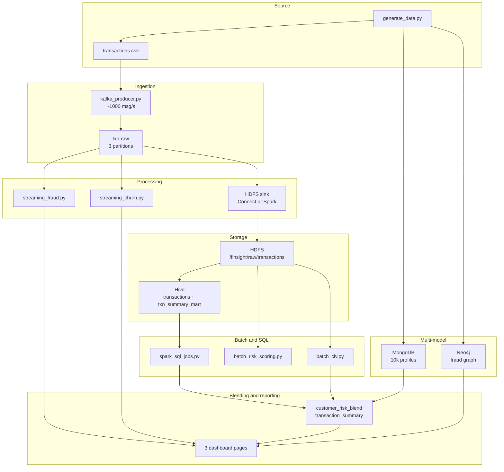

# Architecture

## Layers

FinSight is five layers, each served by one or more of the ten required
technologies. Data flows from raw event ingestion through distributed storage,
real-time and batch processing, multi-model databases and self-service
analytics, terminating in the executive dashboards.

| Layer | Technology | Role |
|---|---|---|
| Ingestion | Kafka | Streams transactions into `txn-raw`; carries `txn-flagged` and `txn-churn` outputs |
| Raw storage | HDFS | Data lake; all events land as Parquet partitioned by step |
| Warehouse | Hive | External SQL tables over HDFS plus a pre-aggregated summary mart |
| Document store | MongoDB | Customer KYC profiles and product preferences as JSON |
| Graph database | Neo4j | Account-transaction graph for fraud ring and money mule detection |
| Stream processing | Spark Streaming | Micro-batch fraud scoring and customer churn detection |
| Batch processing | Spark Core | Nightly risk scoring and customer lifetime value |
| SQL analytics | Spark SQL | Compliance, customer fraud and dormancy reporting |
| Data blending | Alteryx (pandas substitute) | Joins Hive and MongoDB outputs, engineers composite risk |
| Visualisation | Power BI (Streamlit substitute) | Three audience-specific dashboards |

## Data flow



## HDFS layout

```
/finsight
├── raw/transactions/step=<N>/          landed by the sink
├── processed/
│   ├── flagged/                        streaming fraud output
│   ├── streaming_metrics/              per-micro-batch fraud rate
│   ├── churn_alerts/                   streaming churn output
│   ├── risk_scores/                    nightly composite risk
│   ├── daily_summary/                  volume by type and step
│   ├── clv_scores/                     customer lifetime value
│   ├── compliance_summary/             weekly compliance aggregation
│   ├── customer_fraud_summary/         per-customer fraud rates
│   └── dormancy_report/                dormant accounts with severity
├── exports/                            single-file CSVs for the blending layer
└── checkpoints/{fraud,churn,hdfs_sink} streaming state
```

## Design decisions

**External Hive tables, not managed.** Dropping a managed table deletes the
underlying HDFS files — the same files Spark, Kafka Connect and the blending
layer all read. The raw table is `EXTERNAL` so the lake stays authoritative and
the catalogue is disposable. The summary mart is the one managed table, because
it is derived data that should be reclaimed when dropped.

**Transaction as a first-class graph node.** The graph models
`(Account)-[:SENT]->(Transaction)-[:RECEIVED_BY]->(Account)` rather than a
direct account-to-account edge. That is what allows `amount`, `isFraud` and
`step` to be queried along the traversal path, which every fraud query depends
on.

**Steps projected onto event time.** The dataset measures time in steps
(1 step = 1 hour), not wall clock. The churn job maps steps onto a real timeline
so its 24-step requirement becomes a genuine 24-hour event-time window with a
watermark, rather than a processing-time approximation that would break on
replay.

**Two consumer groups on one topic.** The fraud and churn jobs read `txn-raw`
independently, which is why the topic has three partitions. Spec 7.2 R1 requires
both to run simultaneously during the demo, demonstrating that the platform
supports multiple real-time workloads without interference.

**Spark 4.0 paired with Hive 4.0.** Spark's built-in Hive client is 2.3.10 and
cannot complete a 4.x metastore handshake. Spark 4.0 supports metastore clients
up to 4.0.0 through an isolated classloader, so the 4.0.0 client jars are baked
into the Spark image at `/opt/hive-jars` and selected via
`spark.sql.hive.metastore.jars=path`. No Maven fetch happens at job start.

**Profiled compose stack.** Twelve containers do not fit comfortably in 16GB, so
each service carries a profile (`core`, `ingest`, `warehouse`, `nosql`,
`compute`) and only the Day 5 demo brings everything up at once.

## Metric definitions

Each of these is expressed in exactly two places — the Spark job and the
`tools/offline_exports.py` fallback — and `make verify` asserts they agree.

| Metric | Definition | Spec |
|---|---|---|
| Fraud flag | `type IN (TRANSFER, CASH_OUT) AND amount > 200000 AND newbalanceDest = 0` | 7.1 |
| Churn alert | 2+ of: frequency collapse, spend collapse, CASH_OUT-only, balance drain | 7.2 |
| Risk score | Weighted: frequency 0.25, avg transfer 0.30, cash-out ratio 0.25, unique destinations 0.20 | 7.3 |
| Risk tier | Low < 0.25, Medium 0.25–0.60, High > 0.60 | 7.3 R1 |
| CLV score | Weighted: volume 0.30, frequency 0.25, diversity 0.25, recency 0.20 | 7.4 |
| CLV tier | High Value > 0.70, Growth Potential 0.40–0.70, At Risk < 0.40 | 7.4 |
| Dormant | Inactive > 72 steps, ≥ 5 prior transactions, customer account | 7.6 |
| Severely dormant | Inactive > 120 steps | 7.6 R1 |
| Composite risk | `(fraud_rate_pct × 0.6) + (churn_probability × 0.4)` | 9.1 |

The spec names the four risk-scoring factors but not their weights; the values
above are chosen so behavioural breadth and cash-out concentration together
outweigh raw volume, which is the usual shape of a mule-detection score. The CLV
weights are given explicitly in the spec.
